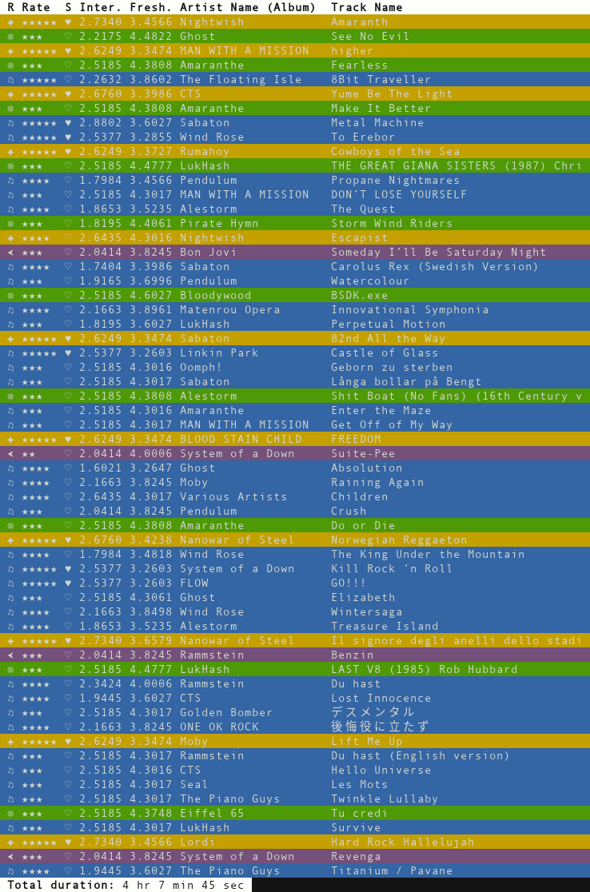

FLOZz Daily Mix
===============

|GitHub| |License| |Discord| |Github Actions| |Black|

FLOZz Daily Mix generates playlists similar to Spotify's Daily Mix from a Subsonic API.

This is currently a **work in progress** and it has only been tested against ownCloud / Nextcloud Music servers. Please note that only the legacy plain text password authentication is currently supported; that's why it will probably not work with most Subsonic servers.

This generator does not make completely random playlists but tries to build interesting ones. It adds "interesting" tracks regularly in the playlist (more at the beginning of the list and more spaced then). It also tries to put new/fresh tracks in at strategic places.

Here is an example of a generated playlist:

* **Yellow:** "interesting" tracks (criteria: high rating, liked,...)
* **Green:** "fresh" tracks (criteria: newly added, recently released, low play count,...)
* **Purple:** "back catalog" tracks (hasn't been played for a long time)
* **Blue:** "regular" tracks (random tracks with rate weighting)

Requirements
------------

This software only requires **Python >= 3.8**. There is no extra dependency.

Install
-------

Linux: from PyPI with venv
~~~~~~~~~~~~~~~~~~~~~~~~~~

To install FLOZz Daily Mix on Linux, the simplest way is to use the package from PyPI.

First be sure to have Python 3 installed with the venv module. On Debian / Ubuntu, you can achieve this with the following command::

    sudo apt install python3 python3-venv

Then we can create the virtualenv to install the app::

    python3 -m venv ./daily-mix.venv

And finally we can install FLOZz Daily Mix in the venv::

    ./daily-mix.venv/bin/pip install flozz-daily-mix

To run the software, just call its executable with a command like this::

    ./daily-mix.venv/bin/flozz-daily-mix --help

Configuration files
-------------------

To generate playlists with FLOZz Daily Mix, you should at least create one file with some information about the playlists. This file can also contain the Subsonic API settings and credential, but you will also be able to pass them later on the CLI.

Here is a commented example of a valid ``flozz-daily-mix.conf`` file:

.. code-block:: ini

    [subsonic]
    ; URL of the Subsonic API.
    ; Can also be provieded using the --subsonic-api-url CLI option.
    api_url = https://nextcloud.example.org/apps/music/subsonic
    ; Name of the Subsonic API user.
    ; Can also be provieded using the --subsonic-api-username CLI option.
    api_username = foobar
    ; Password of the Subsonic API user.
    ; Can also be provieded using the --subsonic-api-password CLI option.
    api_password = s3cr3tp4ssw0rd
    ; Use the Subsonic legacy (plaintext password) authentication method
    ; (default: false). By default this is turned off, but the legacy
    ; authentication is currently the only one supported so you must set it to
    ; "true".
    api_legacy_authentication = true

    ; [playlist:<PLAYLIST_UNIQUE_ID>]
    [playlist:mix1]
    ; Name of the playlist. Will be displayed by music clients (default: "Unnamed Mix")
    name = FLOZz Mix 1
    ; An optional description for the playlist (default: "FLOZz Daily Mix")
    description = FLOzz Daily Mix
    ; Maximum number of tracks in the playlist (default: 60).
    max_tracks = 60
    ; Minimal duration of tracks included in the playlist in seconds (default: 60)
    min_track_duration = 60
    ; Maximal duration of tracks included in the playlist in seconds (default: 600)
    max_track_duration = 600
    ; Ignore tracks whose name matches the given regexp. The regexp are processed
    ; by Python `re` module and are case insensitive.
    ; Default: empty string (disables the filter)
    ignore_tracks_matching = ^.*(intro(duction)?|instrumental|acoustic).*$
    ; Minimal rating for a track to be included in the playlist (from 1 to 5, default: 2)
    minimal_tracks_rating = 2
    ; Comma-separated list of music genres to include in the playlist
    ; (empty or "all" to include all genres, default: "all").
    ; NOTE¹: Subgenres are also included, so if you add "folk rock", it will also
    ;        include its subgenres ("british folk rock", "celtic rock", "medieval
    ;        rock", "phleng phuea chiwit" and "rock rural")
    ; NOTE²: FLOZz Daily Mix support all genres known to MusicBrainz database.
    ;        List available at https://musicbrainz.org/genres
    genres = all

    ; An other playlist
    [playlist:mix2]
    name = FLOZz Mix 2
    description = FLOzz Daily Mix
    max_tracks = 60
    min_track_duration = 60
    max_track_duration = 600
    ignore_tracks_matching = ^.*(intro(duction)?|instrumental|acoustic).*$
    minimal_tracks_rating = 2
    genres = Pop, Rock, Metal

Usage
-----

**NOTE:** in this section I will use commands like ``flozz-daily-mix --help`` for readability, but if you installed FLOZz Daily Mix in a virtualenv as explained above, the command you should use will be something like ``/path/to/your/daily-mix.venv/bin/flozz-daily-mix --help``.

Generating Playlists
~~~~~~~~~~~~~~~~~~~~

Once you have installed FLOZz Daily Mix and created a configuration file, you can start generating playlists.

If your API credentials are configured in the file, you can generate your playlists with the following command::

    flozz-daily-mix generate flozz-daily-mix.conf

If you do not wrote API configuration in the file, then the command will be a bit longer::

    flozz-daily-mix \
        --subsonic-api-url=https://nextcloud.example.org/apps/music/subsonic \
        --subsonic-api-username=foobar \
        --subsonic-api-password=s3cr3tp4ssw0rd \
        --subsonic-api-legacy-authentication \
        generate flozz-daily-mix.conf

**NOTE:** You can pass more than one configuration file, if you prefer writing one file per playlist.

You can also just generate and display playlists without writing them to the cloud::

    flozz-daily-mix generate --dry-run --print-playlist flozz-daily-mix.conf

Listing Known Genres
~~~~~~~~~~~~~~~~~~~~

To list genres known to FLOZz Daily Mix, use the follwoing command::

    flozz-daily-mix genres

This will list the known genre as a tree::

    ...
    ├╴Rock (rock music)
    │ ├╴Art Rock (art-rock)
    │ ├╴Anatolian Rock (anadolu rock)
    │ ├╴Arena Rock
    │ ├╴Aor (adult oriented rock, adult-oriented rock)
    │ ├╴Alternative Rock (alt-rock, alt rock)
    │ │ ├╴Alternative Dance
    │ │ │ ├╴Madchester (baggy)
    │ │ │ └╴New Rave
    │ │ ├╴Britpop (brit pop)
    │ │ ├╴Dream Pop (dreampop)
    ...

Known aliases for the genre name are listed in parenthesis.

Getting Help
~~~~~~~~~~~~

To get all available options, you can use the following commands::

    flozz-daily-mix --help
    flozz-daily-mix generate --help
    flozz-daily-mix genres --help
    flozz-daily-mix dumpdata --help  # debug feature

Contributing
------------

Questions
~~~~~~~~~

If you have any question, you can:

* `Open an issue <https://github.com/flozz/daily-mix/issues>`_ on GitHub
* `Ask on Discord <https://discord.gg/P77sWhuSs4>`_ (I am not always available to chat, but I try to answer to everyone)

Bugs
~~~~

Please `open an issue <https://github.com/flozz/daily-mix/issues>`_ on GitHub with as much information as possible if you found a bug:

* Your operating system / Linux distribution (and its version)
* How you installed the software
* All the logs and message outputted by the software
* etc.

Pull requests
~~~~~~~~~~~~~

Please consider `filing a bug <https://github.com/flozz/daily-mix/issues>`_ before starting to work on a new feature; it will allow us to discuss the best way to do it. It is obviously unnecessary if you just want to fix a typo or small errors in the code.

Please note that your code must follow the coding style defined by the `pep8 <https://pep8.org>`_ and pass tests. `Black <https://black.readthedocs.io/en/stable>`_ and `Flake8 <https://flake8.pycqa.org/en/latest>`_ are used on this project to enforce the coding style.

Use a local database
~~~~~~~~~~~~~~~~~~~~

Reading data from the cloud API can be slow while developing. That's why it is possible to dump data to a file and to reuse it.

First dump the data (Subsonic API credential required)::

    flozz-daily-mix dumpdata -c file-with-credentials.conf music.db

Then you can use the data with the ``generate`` command::

    flozz-daily-mix generate --source-db=music.db --dry-run --print-playlist flozz-daily-mix.conf

**NOTE:** the command above does not require the API credential as it is both a dry-run (no write to the API) and we provide the data (no read from the API).

You can also list genres reading them from the dumped database::

    flozz-daily-mix genres --source-db=music.db

Nextcloud test Docker container
~~~~~~~~~~~~~~~~~~~~~~~~~~~~~~~

A Nextcloud test container with some fake data is available for testing purpose.

To build and start the container (Docker must be installed)::

    nox --session start_nextcloud_docker

To stop the container (Docker must be installed)::

    nox --session stop_nextcloud_docker

The Nextcloud instance is available on localhost:

* Nextcloud URL: http://localhost:8090/
* Nextcloud Login: ``admin``
* Nextcloud Password: ``password``
* Subsonic API URL: http://localhost:8090/apps/music/subsonic
* Subsonic API Login & Password: same as the Nextcloud ones

You can try generating a playlist with the following command::

    python3 -m flozz_daily_mix -V -s http://localhost:8090/apps/music/subsonic -u admin -p password -l generate -n -P YOUR_CONF_FILE.conf

WARNING: All the tracks are fake and only contains a 1 second blank sound. You must set ``min_track_duration`` to ``0`` in your config to allow them to be included in a playlist!

Run the tests
~~~~~~~~~~~~~

You must install `Nox <https://nox.thea.codes/>`__ first::

    pip3 install nox

Then you can check for lint error::

    nox --session lint

and run the tests::

    nox --session test

You can use following commands to run the tests only on a certain Python version (the corresponding Python interpreter must be installed on your machine)::

    nox --session test-3.9
    nox --session test-3.10
    nox --session test-3.11
    nox --session test-3.12
    nox --session test-3.13

You can also fix coding style errors automatically with::

    nox --session black_fix

Update genres from MusicBrainz
~~~~~~~~~~~~~~~~~~~~~~~~~~~~~~

To update genre files (``flozz_daily_mix/data/musicbrainz_db/*``), run::

    ./scripts/update-genres.py

WARNING: It will take tens of minutes to download the archive and to exract the files.

Update test DB
~~~~~~~~~~~~~~

This DB is used to run some of the tests.

To update the ``./tests/fixtures/music.db`` file, first start the Nexctloud Docker container::

    nox --session start_nextcloud_docker

Then run the following script from the project's root dir::

    ./scripts/update-test-db.sh

Support this project
--------------------

Want to support this project?

* `☕️ Buy me a coffee <https://www.buymeacoffee.com/flozz>`__
* `💵️ Give me a tip on PayPal <https://www.paypal.me/0xflozz>`__
* `❤️ Sponsor me on GitHub <https://github.com/sponsors/flozz>`__

Changelog
---------

* **[NEXT]** (changes on ``master`` that have not been released yet):

  * Nothing yet ;)

* **v0.4.0:**

  * feat(generate): Added genre support (@flozz)

    * Added builtin genre list and aliases from MusicBrainz (+ script to update them)
    * Added an option to filter genres in playlists
    * Tracks and album genre are now imported when building the DB
    * Added a command to list known genre as a tree (``flozz_daily_mix genres``)

  * tests: Added unit tests using Pytest (@flozz)
  * tests: Added a Nextcloud Docker image with Nextcloud Music app and test data (@flozz)
  * fix(subsonic): Fixed crashes on missing attribute on artist/album/tracks (@flozz)
  * misc: Added Python 3.13 support (@flozz)
  * misc!: Removed Python 3.8 support (@flozz)

* **v0.3.0:**

  * feat: Added "back catalog" slots to generated playlists (@flozz)

* **v0.2.0:**

  * feat: Improved logging and added ``--quiet`` and ``--verbose`` CLI options (@flozz)
  * feat: Added an ``ignore_tracks_matching`` option to filter tracks whose name matches the given pattern (@flozz)
  * feat: Output warning for wrong settings instead of ignoring them silently (@flozz)
  * feat: Added a ``minimal_track_rating`` filter option (@flozz)
  * fix: Add missing math functions when SQLite is not compiled with ``SQLITE_ENABLE_MATH_FUNCTIONS`` (@flozz)

* **v0.1.0:**

  * feat: Get available musics from a Subsonic API, generate the playlists and write it to the API (@flozz)
  * feat: Implemented command line interface (@flozz)
  * feat: Implemented configuration file (@flozz)
  * feat: Implemented basic debug features (data dump, print playlist, dry-run) (@flozz)
  * docs: Initial basic documentation in the README (@flozz)

.. |GitHub| image:: https://img.shields.io/github/stars/flozz/daily-mix?label=GitHub&logo=github
   :target: https://github.com/flozz/daily-mix

.. |License| image:: https://img.shields.io/github/license/flozz/daily-mix
   :target: https://github.com/flozz/daily-mix/blob/master/COPYING

.. |Discord| image:: https://img.shields.io/badge/chat-Discord-8c9eff?logo=discord&logoColor=ffffff
   :target: https://discord.gg/P77sWhuSs4

.. |Github Actions| image:: https://github.com/flozz/daily-mix/actions/workflows/python-ci.yml/badge.svg
   :target: https://github.com/flozz/daily-mix/actions

.. |Black| image:: https://img.shields.io/badge/code%20style-black-000000.svg
   :target: https://black.readthedocs.io/en/stable
